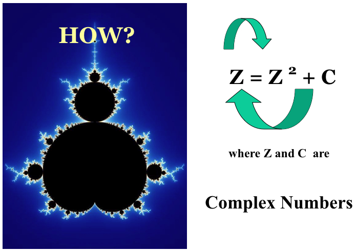

# mandelbrot-js
Creates Initial image of a Mandelbrot set with p5.js

## what is Mandelbrot set
a particular set of complex numbers ```c``` that  which the function ```f(z) = z^2 + c``` remains bounded and does not tend towards infinity.
It is a fractal pattern that looks really cool.  I can't explain it as well as probably anyone else, but you can read more about it [here](https://www.youtube.com/watch?v=NGMRB4O922I).  But pretty much keep calculating Z and passing it back into the equation and seeing if that number tends to stay bounded around a number, or just explode off into infinity.  The numbers in the Mandelbrot set are the ones that remain bounded.




